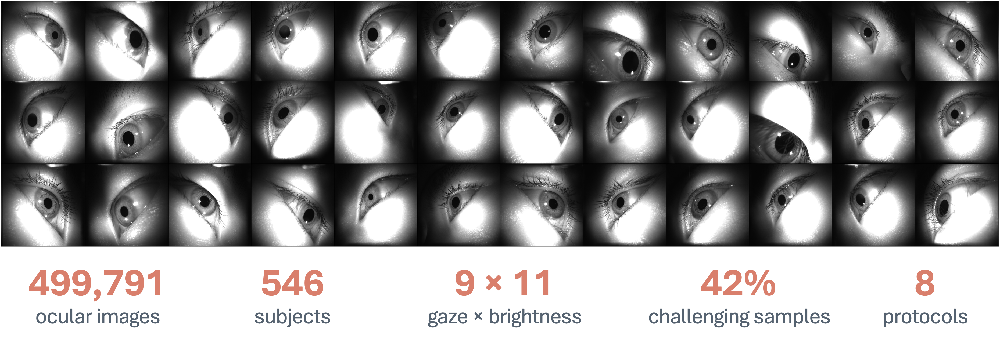
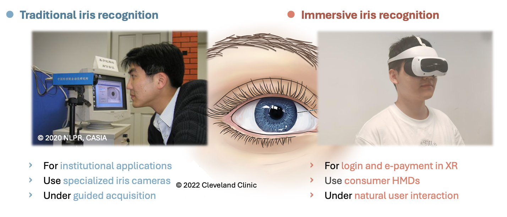
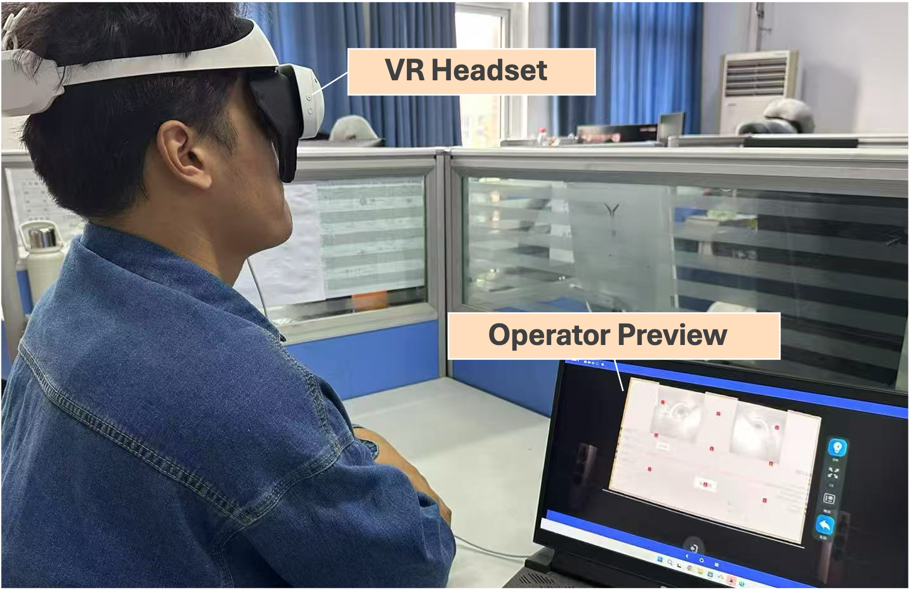
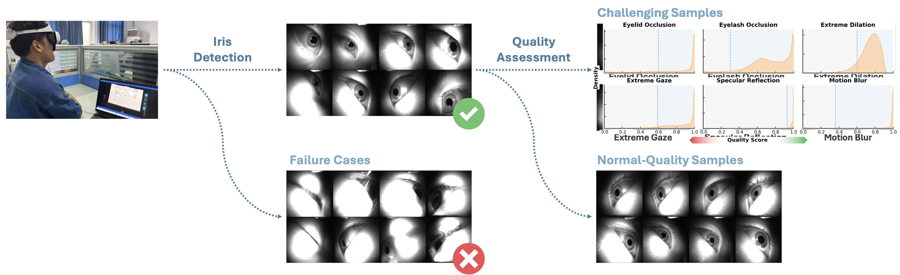
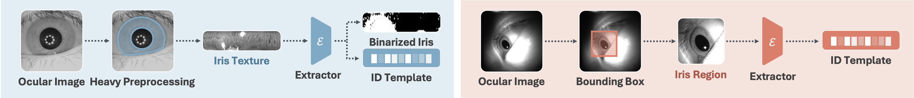
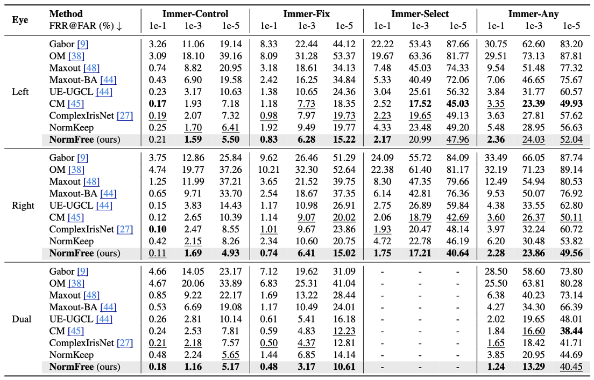
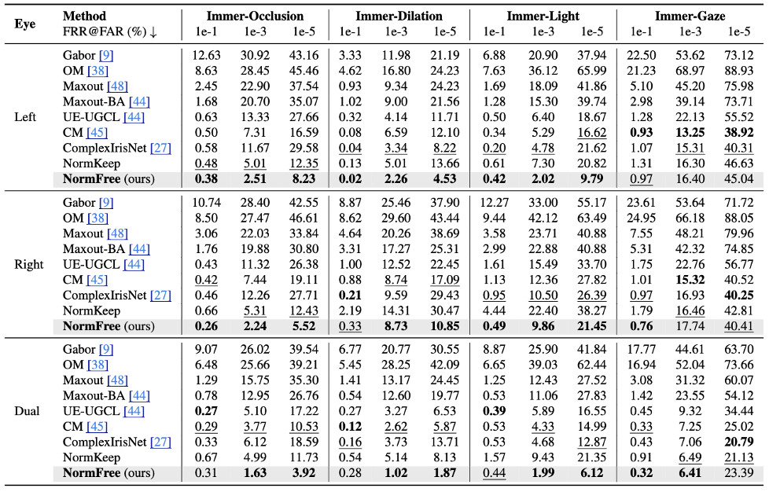
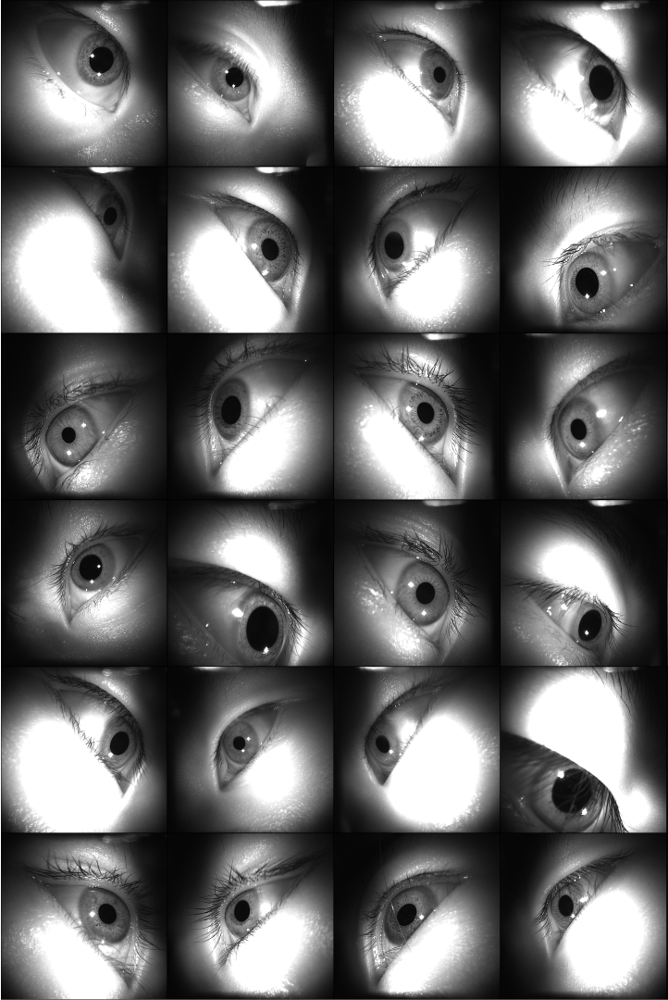
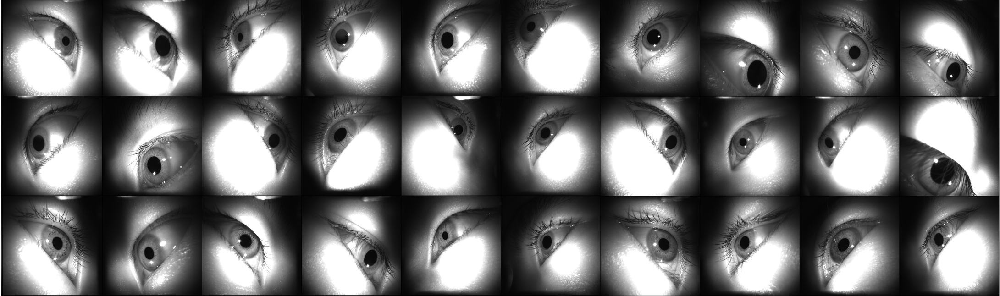

[](#citation)
[](#overview)
[](#benchmark)

# ImmerIris
This repository presents **ImmerIris**, a large-scale public iris dataset and benchmark for **off-axis** and **unconstrained** recognition in immersive XR applications.

<p align="center">
  
</p>

## Overview
Traditional iris recognition usually assumes frontal capture, controlled lighting, and cooperative users. In immersive applications, however, headset-mounted cameras observe the eye from the side while users naturally change gaze direction and interact in dynamic scenes.

**ImmerIris** is built to study this setting directly. It provides realistic off-axis ocular images, challenging quality variations, and a benchmark that exposes where current iris recognition systems fail under immersive conditions.

## Highlights
- **499,791 ocular images** collected from **546 subjects**.
- Images are captured with a **VR headset** using side-mounted near-infrared cameras.
- Acquisition covers **9 gaze positions** and **11 brightness conditions**.
- Around **42% challenging samples** with realistic degradations.
- Includes **8 evaluation protocols** for immersive iris recognition.

## Dataset
ImmerIris is designed around real XR capture conditions rather than laboratory-style iris collection.

### Key Properties
- **Headset acquisition**: ocular images are captured from a consumer HMD in an immersive setup.
- **Off-axis gaze variation**: subjects fixate on a `3 x 3` gaze grid, creating strong geometric variation.
- **Open-scene quality issues**: samples include occlusion, dilation, reflection, extreme gaze, and motion blur.

<p align="center">
  
</p>

<p align="center">
  
</p>

## Cleaning and Annotation
The dataset pipeline removes severe capture failures, keeps normal-quality samples, and scores images across multiple quality dimensions. These annotations support both isolated-factor analysis and realistic combined-condition protocols.

Factors considered in the benchmark include:
- eyelid and eyelash occlusion
- pupil dilation
- illumination change
- gaze variation
- specular reflection
- motion blur

<p align="center">
  
</p>

## Benchmark
ImmerIris defines **8 protocols** to evaluate immersive iris recognition.

### Isolated Protocols
- **Occlusion**: tests partially covered iris texture.
- **Dilation**: measures changes caused by pupil expansion.
- **Light**: evaluates low- and high-brightness variation.
- **Gaze**: focuses on geometry changes across gaze directions.

### Combined Protocols
- **Control**: off-axis capture with fixed gaze and normal-quality samples.
- **Fix**: fixed gaze with realistic degradations.
- **Select**: natural gaze while excluding the most extreme directions.
- **Any**: fully unconstrained pairing for open-scene immersive recognition.

## Method: NormFree
Along with the benchmark, we present **NormFree**, a normalization-free recognition pipeline.

Instead of first unwrapping iris texture into a normalized strip, NormFree:
- crops the iris region with a robust bounding box
- learns features directly from the cropped image
- uses a face-recognition-style backbone with an angular-margin objective

This simpler design remains competitive under immersive capture conditions, especially when conventional normalization-based methods degrade.

<p align="center">
  
</p>

## Results
Existing normalization-based methods degrade noticeably as the evaluation protocols become less constrained. **NormFree** ranks first or second in most verification settings and remains strong for identification tasks.

<p align="center">
  
  
</p>

## Sample Gallery
<p align="center">
  
</p>

<p align="center">
  
</p>

## Dataset Access
The repository page and website indicate that public release is managed through a formal application process for research use.

At the moment, the dataset access entry is marked as **Coming Soon** in the project page. When the official access form or download link is available, you can add it here, for example:

```md
## Download
[Dataset Access Form](YOUR_LINK_HERE)
```

## Citation
If you use **ImmerIris** in your research, please cite:

```bibtex
@inproceedings{mi2026immeriris,
  title     = {ImmerIris: A Large-Scale Dataset and Benchmark for Off-Axis and Unconstrained Iris Recognition in Immersive Applications},
  author    = {Mi, Yuxi and Yuan, Qiuyang and Zhong, Zhizhou and Zhao, Xuan and Zhou, Jiaogen and Zhu, Fubao and Guan, Jihong and Zhou, Shuigeng},
  booktitle = {Proceedings of the IEEE/CVF Conference on Computer Vision and Pattern Recognition},
  year      = {2026}
}
```
