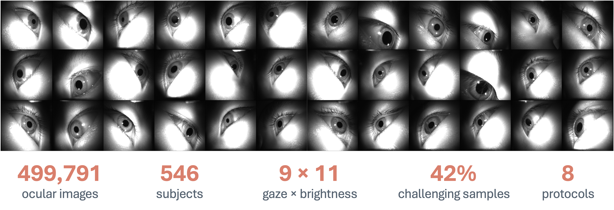
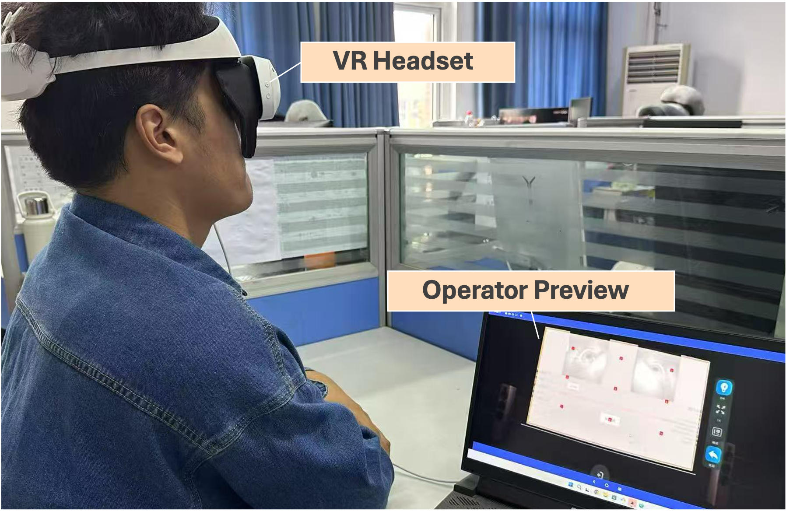
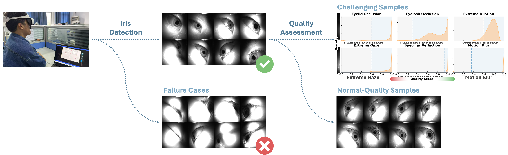
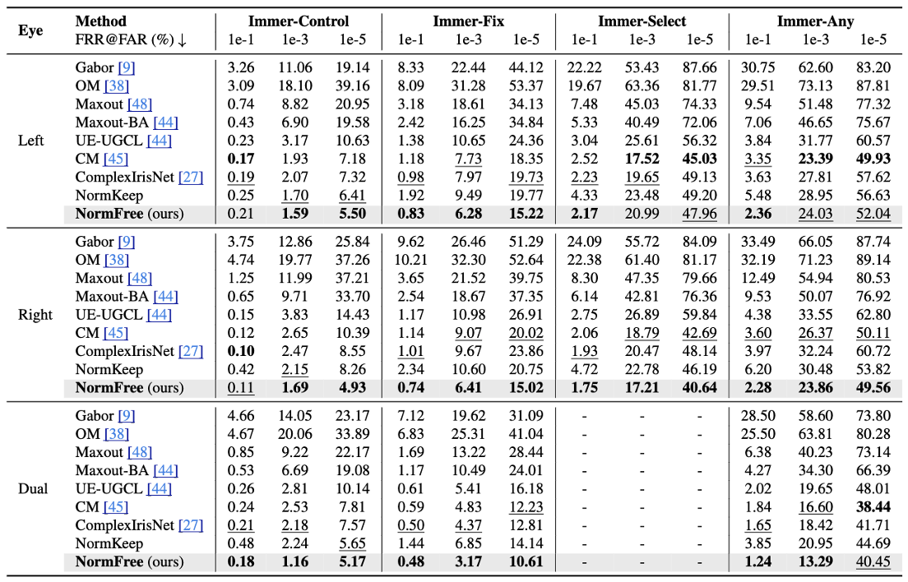
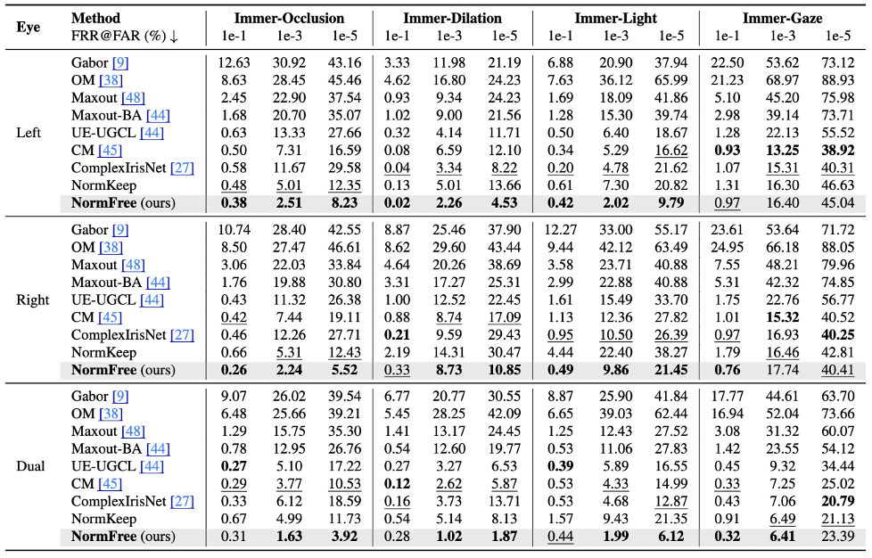

[](#overview)
[](https://arxiv.org/abs/2510.10113)

<h1 align="center">ImmerIris</h1>

<p align="center">
  <strong>A Large-Scale Dataset and Benchmark for Off-Axis and Unconstrained Iris Recognition in Immersive Applications</strong>
</p>

<p align="center">
  <em>CVPR 2026 Award Candidate & Oral Presentation</em>
</p>

<p align="center">
  <a href="https://arxiv.org/abs/2510.10113">Paper</a> |
  <a href="https://drive.google.com/file/d/1j8oTcBEyCh4KMu3-Gn5gbxvG_fI6jdOP/view?usp=drive_link">Benchmark Protocol</a> |
  <a href="#dataset-access">Dataset Access</a> |
  <a href="#citation">Citation</a>
</p>


<p>
<strong>ImmerIris</strong> contains <strong>499,791 ocular images from 546 subjects</strong>, acquired via head-mounted displays. It is designed to capture the unique challenges introduced by immersive acquisition, including <strong>perspective distortion</strong>, <strong>intra-subject variation</strong>, and <strong>quality degradation</strong> in iris textures.
</p>

<p align="center">
  
</p>

<a id="overview"></a>

## 🌍 Overview

Traditional iris recognition typically acquires on-axis ocular images in controlled setups. In immersive applications such as extended reality, however, head-mounted-display cameras are usually placed at an angle to the eyes, producing off-axis images under less constrained user interaction.

**ImmerIris** fills this gap by providing a large-scale dataset acquired off-axis and unconstrained via VR headsets. It is accompanied by a comprehensive set of evaluation protocols that benchmark recognition systems under varying operation modes and challenging conditions.

Our benchmark shows that existing state-of-the-art iris recognition methods, which mostly rely on a pre-processing **normalization stage**, are not readily generalizable to the immersive scenario. We further provide **NormFree**, a simple normalization-free paradigm that directly learns from minimally adjusted ocular images and achieves superior performance in most cases.

## ✨ Highlights

- 👁️ **499,791 ocular images** from **546 subjects**.
- 🕶️ Off-axis acquisition via consumer head-mounted displays.
- 🧭 Explicit variations in **9 gaze positions** and **11 brightness levels**.
- ⚠️ Approximately **42% degraded images** in at least one quality dimension.
- 📏 **8 evaluation protocols** for isolated and combined challenging factors.
- 🛠️ A simple **normalization-free paradigm** for immersive iris recognition.

## 📚 Dataset

ImmerIris is collected using a general-purpose VR headset equipped with side-mounted near-infrared cameras. The acquisition setup closely mimics real-world immersive XR experiences, where ocular images are captured off-axis and under less constrained interaction.


<p align="center">
  
</p>

The dataset captures three distinctive challenges of immersive iris recognition:

- **Perspective distortion**, caused by tilted camera-eye geometries;
- **Intra-subject variation**, mainly arising from illumination and gaze-direction changes;
- **Quality degradation**, including eyelid/eyelash occlusion, extensive pupil dilation, extreme off-axis gaze, specular reflection, and motion blur.

<p align="center">
  
</p>

<a id="benchmark"></a>

## 🎯 Benchmark

ImmerIris defines **8 evaluation protocols** to systematically examine the isolated and combined effects of intra-subject variations and quality degradations. Off-axis perspective distortion is inherent throughout the dataset and is therefore included in all protocols.

| Protocol | Distortion | Illumination | Gaze | Occlusion | Dilation | Reflection | Blur |
| --- | --- | --- | --- | --- | --- | --- | --- |
| **Immer-Occlusion** | • | △ | × | • | × | × | × |
| **Immer-Dilation** | • | △ | × | × | • | × | × |
| **Immer-Light** | • | • | × | × | △ | × | × |
| **Immer-Gaze** | • | △ | • | × | × | × | × |
| **Immer-Control** | • | △ | × | × | × | × | × |
| **Immer-Fix** | • | • | × | • | • | • | • |
| **Immer-Select** | • | • | ◦ | • | • | • | • |
| **Immer-Any** | • | • | • | • | • | • | • |

Symbols: `•` explicitly included/studied, `◦` partially included, `△` implicitly included, and `×` excluded.

## 📈 Results

Existing normalization-based methods perform well under traditional controlled setups but degrade sharply under immersive conditions. This reveals a substantial domain gap and highlights the limitation of relying on fallible normalization for off-axis and unconstrained ocular images.

Being normalization-free dispenses with the normalization stage and directly learns from cropped iris regions. Despite its simplicity, it outperforms normalization-based prior arts in most verification settings and remains strong for identification.

<p align="center">
  
  
</p>

<a id="dataset-access"></a>

## 🔓 Data and Protocol Access

The **benchmark protocol files** are  available via Google Drive:

- **Benchmark Protocol:** [Google Drive](https://drive.google.com/file/d/1j8oTcBEyCh4KMu3-Gn5gbxvG_fI6jdOP/view?usp=drive_link)

The **ImmerIris dataset** will be released for academic research use under controlled access. Since iris images are sensitive biometric data, we follow the common practice in the biometric research community and do not provide unrestricted public download. Access requests will be reviewed case by case.

To request dataset access, please contact:

```md
yxmi20 [at] fudan.edu.cn
```

We are also working to formalize the access procedure and will provide a more convenient application process as soon as possible.

<a id="citation"></a>

## 📌 Citation

If you use **ImmerIris** in your research, please cite:

```bibtex
@inproceedings{mi2026immeriris,
  title     = {ImmerIris: A Large-Scale Dataset and Benchmark for Off-Axis and Unconstrained Iris Recognition in Immersive Applications},
  author    = {Mi, Yuxi and Yuan, Qiuyang and Zhong, Zhizhou and Zhao, Xuan and Zhou, Jiaogen and Zhu, Fubao and Guan, Jihong and Zhou, Shuigeng},
  booktitle = {Proceedings of the IEEE/CVF Conference on Computer Vision and Pattern Recognition},
  year      = {2026}
}
```
